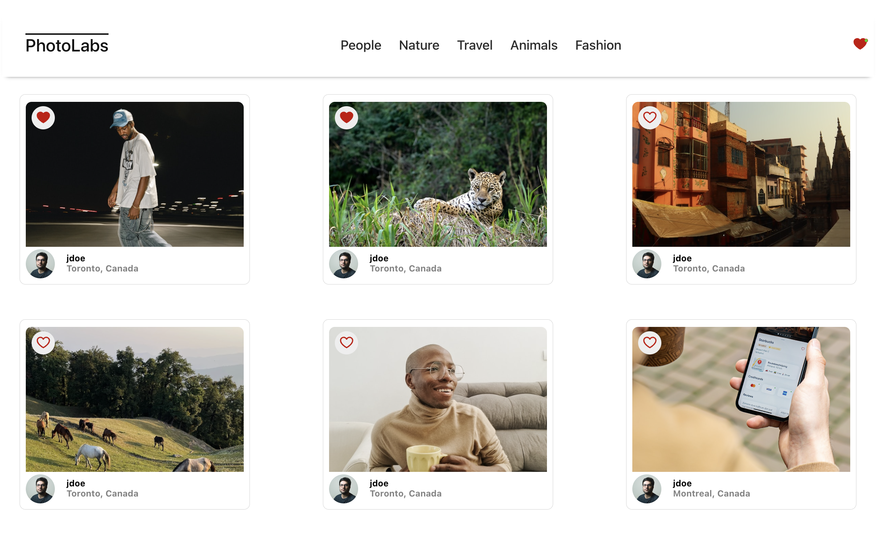

# react-photolabs
A Photo-Sharing app developed for the Lighthouse Labs Web Development course. 

# Photolabs

## Final Product
**View Photos By Topic:**\
\
**Favourite Photos**\
\
**Open Photo Expanded View**\


## Setup

Install dependencies with `npm install` in each respective `/frontend` and `/backend`.

## [Frontend] Running Webpack Development Server

```sh
cd frontend
npm start
```

## [Backend] Running Backend Servier

Read `backend/readme` for further setup details.

```sh
cd backend
npm start
```

## Using the App
- Navigate photo topics from the top nav bar
- Favourite a photo by clicking the heart button on the desired photo
- Keep track of whether you have favourite photos by checking the heart on the nav bar
- Click on any picture to bring up its expanded view and similar photos


